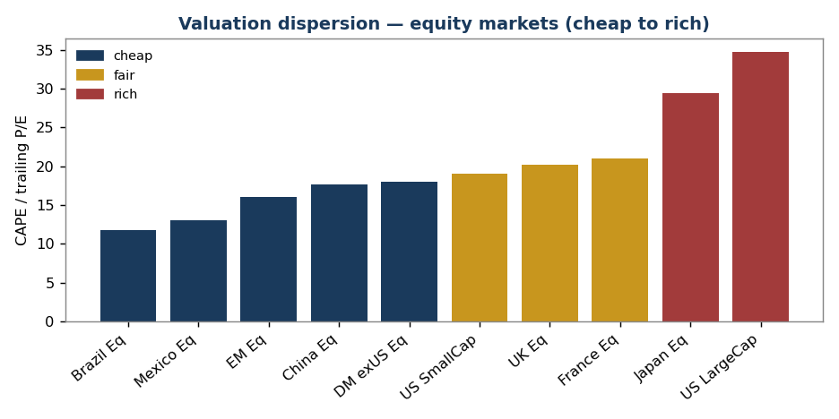
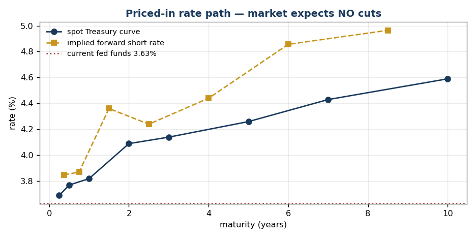
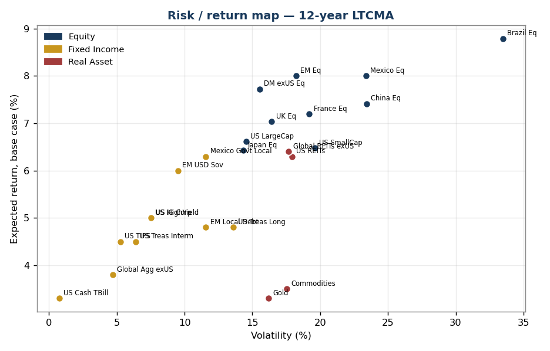
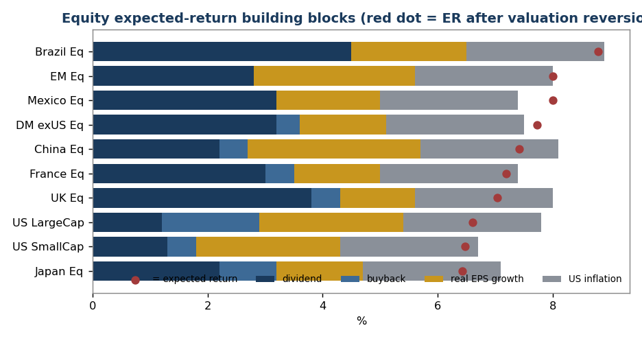
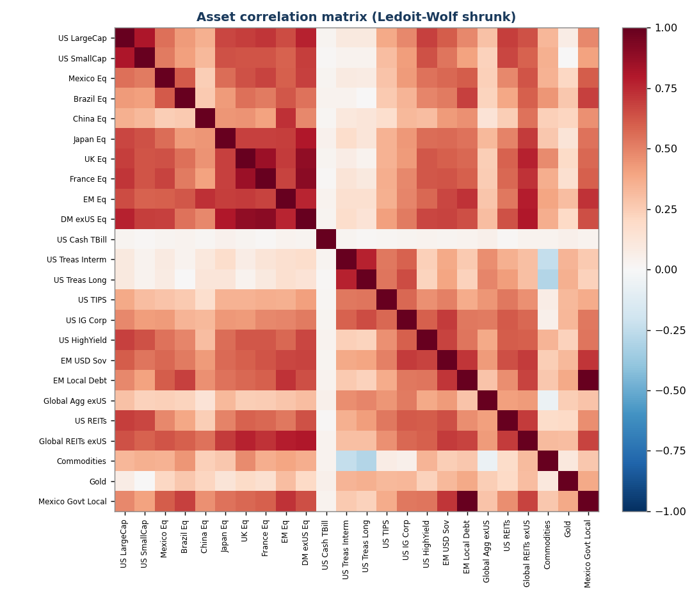
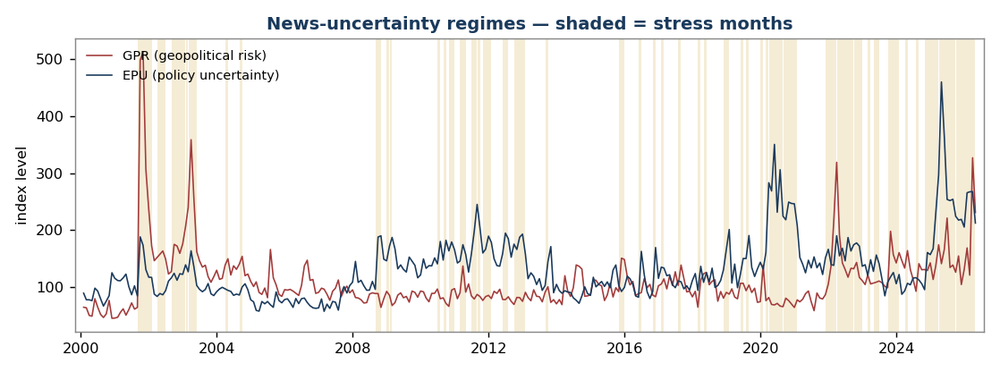
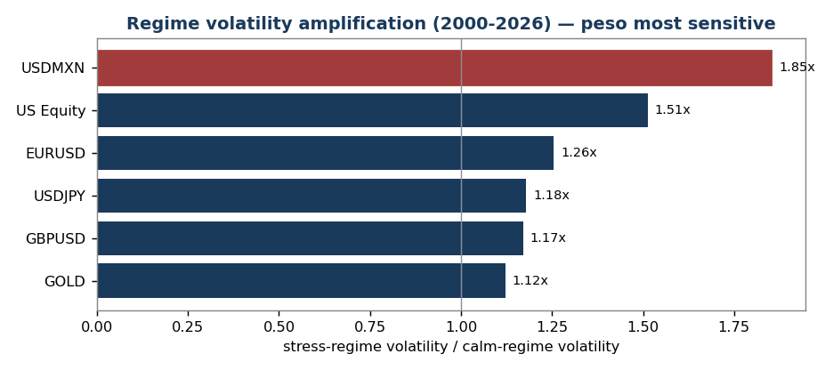
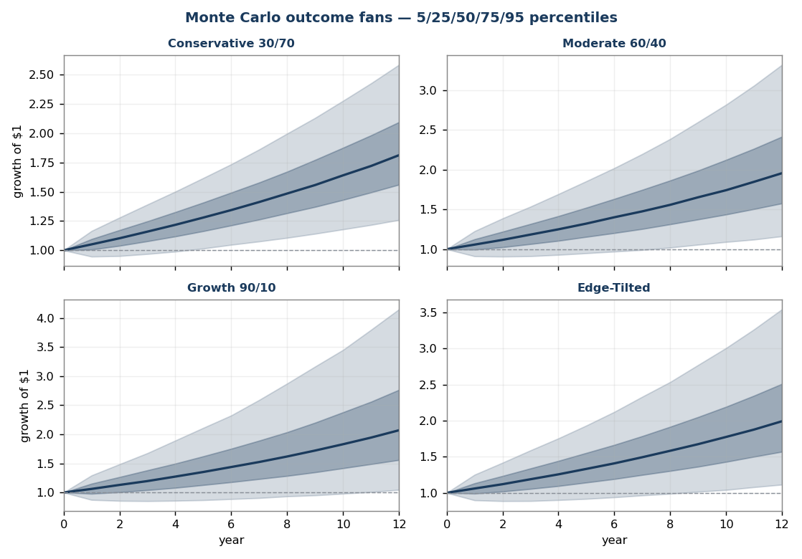

# Long-Term Capital Market Assumptions — 2026 Edition

**A proprietary 12-year forward outlook for global asset classes**

- **As-of date:** 18 May 2026
- **Base currency:** USD
- **Horizon:** 12 years (midpoint of a 10–15-year window)
- **Universe:** 24 asset classes spanning global equities, fixed income, and real assets
- **Engine:** building-block returns + Ledoit-Wolf shrinkage + regime-switching GPU Monte Carlo
- **Data:** free public sources — Yahoo Finance, FRED, Damodaran (1928+),
  Shiller (1871+), Ken French (1990+), Siblis Research, the GPR and EPU
  uncertainty indices, central banks

> This document is the *strategic* layer (Step 1) of a three-step allocation
> process: (1) LTCMA 10–15-year assumptions → (2) normalize to a 3–5-year
> cycle-aware forecast → (3) overlay current macro indicators. Reviewed annually.

**Reading this report.** Every technical term — CAPE, volatility, Monte Carlo,
regime-switching, and the rest — is explained in plain language in the
[Glossary](glossary.html). All figures are in **USD** unless noted otherwise.

---

## 1. Executive Summary

After a long US-led bull market, **the starting point for the next decade is one
of extreme valuation dispersion.** The US trades at a CAPE of ~35 and Japan ~29,
while Mexico, Brazil, and China trade at 12–18× earnings. That gap drives four
strategic conclusions:

1. **US large-cap equity has the lowest expected return of any equity market
   in the universe (~6.6% base case)** — and the *highest* sensitivity to the
   valuation assumption. A 2.4-percentage-point swing separates the optimistic and
   pessimistic scenarios. Owning US equity at today's multiple is, mathematically,
   a bet that rich valuations persist.

2. **Emerging and Latin American equity offer the highest expected returns
   (~8.0–8.8%)** and the *smallest* valuation bet — their return is carried by
   income and growth, not multiple expansion.

3. **The richest fixed-income edge is in EM local and USD sovereign debt.**
   Mexican local government bonds offer ~6.3% in USD at one of the best downside
   profiles in the universe; EM USD sovereigns ~6.0%. Both beat US investment-grade
   and high-yield credit, which sit at multi-year-tight spreads.

4. **Bonds still diversify, but less reliably than the pre-2021 era.** The
   trailing stock/long-Treasury correlation is ~0.00. Gold (0.12 vs US equity)
   and the Treasury/commodity pairing (−0.35) now do more genuine diversification
   work than nominal bonds alone.

**Two cross-checks against the live market** sharpen the picture:

- **What's priced in (Section 4):** the Treasury curve says the market expects
  **no further rate cuts** — short-rate forwards rise, not fall. Inflation
  expectations (2.5%) sit right on the LTCMA assumption. Credit is priced for
  perfection. The LTCMA's *active bets* are exactly where it diverges from this.
- **News and regime risk (Section 7):** geopolitical and policy uncertainty
  (GPR, EPU indices) are **elevated, and the market is currently in a "stress"
  regime.** Quantified, that history shows stress periods amplify volatility
  (1.2–2.2×) and cross-correlations (0.66→0.74) — but, tellingly, did *not*
  reliably depress returns over 2013–2026.

**Headline expected returns (USD, 12-year, base case):**

| | Point estimate | Simulated 12y median | Volatility |
|---|---|---|---|
| US large-cap equity | 6.6% | 5.7% | 13.6% |
| EM equity | 8.0% | 6.4% | 18.8% |
| Brazil / Mexico equity | 8.8% / 8.0% | 4.1% / 5.7% | 32.7% / 22.4% |
| US Treasury / IG credit | 4.5% – 5.0% | 4.2% – 4.7% | 7.6% – 8.0% |
| EM USD sovereign / Mexican local govt | 6.0% / 6.3% | 5.5% / 5.7% | 9.9% / 11.3% |
| Cash (US T-bills) | 3.3% | 3.2% | 3.4% |

(Simulated medians sit below point estimates by design — the volatility drag on
compounded returns. See Section 7.)

---

## 2. Methodology

### 2.1 Building-block framework

Every serious capital-market-assumptions publisher — J.P. Morgan, BlackRock,
Vanguard, Northern Trust, GMO, Research Affiliates, AQR — uses the same
*building-block* skeleton. Expected return is decomposed into observable,
defensible components rather than extrapolated from past performance.

**Equities** (return expressed directly in USD):

```
ER = dividend yield + net buyback yield + real EPS growth
     + US inflation + λ × valuation reversion
```

The *relative-PPP assumption* lets us anchor on **US** inflation: a foreign
market's local inflation is, over a long horizon, broadly offset by depreciation
of its currency against the dollar.

**Fixed income:** `ER = starting yield + roll − expected credit loss ± normalization`,
where expected credit loss = default rate × (1 − recovery rate).

**Currencies:** purchasing-power parity + real-interest-rate differential.

### 2.2 The valuation-reversion dial (λ) — a multi-firm synthesis

Firms agree on the skeleton; they disagree on *how hard valuations mean-revert.*
This model exposes that choice as one parameter, λ:

| λ | Meaning | Closest to the house view of |
|---|---|---|
| **0.0** | No reversion — today's multiples persist | Momentum / regime views (Bridgewater-style) |
| **0.5** | Partial normalization (**base case**) | J.P. Morgan, BlackRock, Vanguard, Northern Trust |
| **1.0** | Full reversion to fair value | GMO, Research Affiliates, AQR |

Annualized reversion is `(fair multiple / current multiple)^(1/H) − 1`. The
spread across λ is itself a signal — the **"valuation bet"** column.

**The fair-value anchor is data-driven.** Shiller's 150-year series puts the US
CAPE at a 1990+ **median of 26.0** — exactly the anchor used here.

### 2.3 Risk model — shrinkage and long history

Volatility blends a trailing-window estimate with multi-decade history (Shiller
1871+, Ken French 1990+, Damodaran 1928+), plus **25 years of intraday FX history**
(FxPro M5 data aggregated to monthly — EURUSD/USDJPY since 2000, USDMXN since
2007). The covariance matrix uses **Ledoit-Wolf shrinkage** — well-conditioned
and positive semi-definite, a requirement for the simulation engine.

### 2.4 Priced-in indicators

Markets continuously quote their own expectations. Section 4 extracts them —
the rate path implied by Treasury forwards, inflation from breakevens, risk from
VIX and credit spreads — and contrasts each with the LTCMA. Where they diverge,
the LTCMA is making an explicit, identifiable active bet.

### 2.5 Quantifying news and market regimes

Discretionary news — a tariff tweet, a Fed-chair change, a strike on Iran —
cannot be turned into a defensible number tweet-by-tweet. The rigorous approach,
and the one used here, is **established text-based uncertainty indices**:

- **GPR** — Geopolitical Risk index (Caldara-Iacoviello), built from newspaper
  text; spikes on wars and military escalation.
- **EPU** — Economic Policy Uncertainty (Baker-Bloom-Davis); spikes on
  Fed-chair uncertainty, tariff conflict, fiscal standoffs.

These quantify the *aggregate* of the news flow. They are used to classify
history into **calm** and **stress** regimes (Section 7), which then drive the
simulation — so "the news" enters the model as regime probabilities and
regime-specific risk, not as ad-hoc adjustments.

### 2.6 Regime-switching Monte Carlo engine

A GPU Monte Carlo engine simulates **100,000 monthly multi-asset paths** over the
12-year horizon. It is **two-regime Markov-switching** (calm/stress, calibrated
from the news indices) with **Student-t innovations** (fat tails), and it
**starts in the stress regime** to reflect today's elevated-uncertainty reading.
It runs on an NVIDIA RTX 4060 in ~15 seconds and produces full return
*distributions* — percentiles, probability of loss, and conditional tail loss
(CVaR) — for every asset and portfolio.

### 2.7 Consensus and historical cross-checks

- **Forward consensus:** 2026 published LTCMAs put US large-cap equity at 5–7.6%
  and US aggregate bonds at 4.1–4.8%. This model's base case sits inside both.
- **Historical realized (Damodaran, 1928–2025):** US large-cap returned 10.0%
  annualized, 10-year Treasuries 4.5%, T-bills 3.4%. The forward US equity number
  is deliberately below its history — the starting CAPE (35) is far above the
  historical norm.

---

## 3. Macro Backdrop & Fundamentals Grid

| Market | Policy rate | 10Y nominal | 10Y real* | Inflation | Trend real GDP | Equity valuation | Damodaran ERP |
|---|---|---|---|---|---|---|---|
| **US** | ~3.6% | 4.59% | ~1.9% | ~2.7% | ~1.9% | CAPE 34.7 — **rich** | 4.46% |
| **Mexico** | 6.50% | 8.88% | ~4.4% | 4.45% | ~2.0% | P/E 13.0 — **cheap** | 6.69% |
| **Brazil** | 14.50% | ~13.5% | ~9.0% | ~4.5% | ~2.0% | P/E 11.8 — **cheap** | 7.47% |
| **China** | ~3.0% (LPR) | ~1.8% | ~1.3% | ~0.5% | ~4.0% | CAPE 17.7 — **cheap** | 5.14% |
| **Japan** | ~0.75% | 2.52% | ~0.0% | ~2.5% | ~0.7% | CAPE 29.4 — **rich** | 5.14% |
| **UK** | ~3.9% | 4.82% | ~1.8% | ~3.0% | ~1.3% | CAPE 20.2 — **fair** | 5.01% |
| **France** | ~2.0% (ECB) | 3.68% | ~1.9% | ~1.8% | ~1.2% | CAPE ~21 — **fair** | 5.01% |

*Real yield = 10Y nominal − current inflation (approximate).

**What the grid says:** valuation is bimodal — the US and Japan are expensive,
EM/LatAm and China are cheap, with only the UK and France in between. Real yields
favor Latin America massively (Mexico ~4.4%, Brazil ~9%, vs US ~1.9%). Rate
*direction* is no longer a tailwind anywhere — carry, not duration, is where the
return is. China is the contrarian case: cheap and still growing ~4%, but
deflation and policy risk are what the discount prices.



---

## 4. Priced-In Indicators

A capital-market assumption is only *active* where it disagrees with what the
market already expects. This section extracts the market's own forecasts.

### 4.1 Priced-in policy-rate path — the headline

The Treasury curve, read as implied forward rates, reveals the market's expected
path of short rates:

| Period | Implied avg short rate |
|---|---|
| Current fed funds (effective) | 3.63% |
| Next 12 months (1Y Treasury) | 3.82% |
| 1–2 years forward | 4.36% |
| 2–3 years forward | 4.24% |
| 3–5 years forward | 4.44% |
| 5–10 years forward | ~4.9% |

**The market is pricing zero further rate cuts.** Forward short rates *rise*, not
fall — the curve says the Fed's easing cycle is over and the next move is as
likely up as down. This matters: despite a steady "central banks are easing"
narrative, anyone positioning for a rate-cut tailwind is fighting the curve. The
LTCMA's cash assumption (3.3%, assuming a drift toward a ~3.0–3.3% neutral rate)
is *slightly below* what the market prices — a small, deliberate divergence.



### 4.2 Priced-in inflation, risk, and the dashboard

| Signal | What the market prices | LTCMA assumption | Read |
|---|---|---|---|
| **Rate path** | No cuts; 1–2y forward 4.4% | Cash 3.3% | Market more hawkish than the LTCMA's neutral-rate drift |
| **Long-run inflation** | 10y breakeven 2.48%, 5y5y forward 2.27% | 2.40% | **Aligned** — LTCMA sits mid-range |
| **US credit risk** | HY OAS 2.80% (~14th percentile — very tight) | HY 5.0%, tight-spread drag applied | **Agreement** — credit priced for perfection; LTCMA already cautious |
| **Equity volatility** | VIX 18.4 (~historical median) | Equity vols 13–33% | Market calm; no near-term stress priced |
| **Recession** | Yield curve 10Y–3M +0.93% (positive) | n/a | No recession priced in |
| **Policy uncertainty** | EPU 212 (baseline ~100 — elevated) | n/a | **Complacency divergence** — see below |

**The complacency divergence.** Policy uncertainty (EPU) is elevated at ~212
while equity volatility (VIX) sits near its historical median. The market is
treating heavy policy noise — a Fed-chair transition, tariff conflict, the Gulf
situation — as signal-free. Either the noise resolves benignly (the 2013–2026
pattern) or this gap closes through a volatility spike. The regime engine in
Section 7 is built precisely to price that asymmetry.

---

## 5. Expected Returns

### 5.1 Full table (USD, 12-year)

| Asset class | Type | ER λ=0 | **ER base (λ=0.5)** | ER λ=1 | Volatility |
|---|---|---|---|---|---|
| US Large Cap | Equity | 7.8% | **6.6%** | 5.4% | 13.6% |
| US Small Cap | Equity | 6.7% | **6.5%** | 6.3% | 19.6% |
| Mexico Equity | Equity | 7.4% | **8.0%** | 8.6% | 22.4% |
| Brazil Equity | Equity | 8.9% | **8.8%** | 8.7% | 32.7% |
| China Equity | Equity | 8.1% | **7.4%** | 6.7% | 23.1% |
| Japan Equity | Equity | 7.1% | **6.4%** | 5.8% | 16.7% |
| UK Equity | Equity | 8.0% | **7.0%** | 6.1% | 16.6% |
| France Equity | Equity | 7.4% | **7.2%** | 7.0% | 17.7% |
| EM Equity (broad) | Equity | 8.0% | **8.0%** | 8.0% | 18.8% |
| DM ex-US Equity (broad) | Equity | 7.5% | **7.7%** | 8.0% | 15.7% |
| US Cash / T-Bills | Fixed Income | — | **3.3%** | — | 3.4% |
| US Treasury Intermediate | Fixed Income | — | **4.5%** | — | 7.6% |
| US Treasury Long | Fixed Income | — | **4.8%** | — | 15.2% |
| US TIPS | Fixed Income | — | **4.5%** | — | 6.2% |
| US IG Corporate | Fixed Income | — | **5.0%** | — | 8.0% |
| US High Yield | Fixed Income | — | **5.0%** | — | 7.9% |
| EM USD Sovereign | Fixed Income | — | **6.0%** | — | 9.9% |
| EM Local Debt | Fixed Income | — | **4.8%** | — | 11.3% |
| Mexico Govt (local, Mbonos) | Fixed Income | — | **6.3%** | — | 11.3% |
| Global Aggregate ex-US (hedged) | Fixed Income | — | **3.8%** | — | 5.9% |
| US REITs | Real Asset | — | **6.3%** | — | 17.6% |
| Global REITs ex-US | Real Asset | — | **6.4%** | — | 16.5% |
| Commodities (broad) | Real Asset | — | **3.5%** | — | 17.2% |
| Gold | Real Asset | — | **3.3%** | — | 18.6% |



### 5.2 Equity building-block decomposition (base case, λ=0.5)

| Market | Dividend | Buyback | Real EPS growth | US inflation | Valuation reversion | = ER |
|---|---|---|---|---|---|---|
| US Large Cap | 1.2% | 1.7% | 2.5% | 2.4% | −1.2% | 6.6% |
| US Small Cap | 1.3% | 0.5% | 2.5% | 2.4% | −0.2% | 6.5% |
| Mexico | 3.2% | 0.0% | 1.8% | 2.4% | +0.6% | 8.0% |
| Brazil | 4.5% | 0.0% | 2.0% | 2.4% | −0.1% | 8.8% |
| China | 2.2% | 0.5% | 3.0% | 2.4% | −0.7% | 7.4% |
| Japan | 2.2% | 1.0% | 1.5% | 2.4% | −0.7% | 6.4% |
| UK | 3.8% | 0.5% | 1.3% | 2.4% | −1.0% | 7.0% |
| France | 3.0% | 0.5% | 1.5% | 2.4% | −0.2% | 7.2% |
| EM (broad) | 2.8% | 0.0% | 2.8% | 2.4% | 0.0% | 8.0% |
| DM ex-US (broad) | 3.2% | 0.4% | 1.5% | 2.4% | +0.2% | 7.7% |

**US equity's return is built on growth and buybacks fighting a valuation
headwind; EM/LatAm's return is built on income** — a more reliable foundation.



---

## 6. Risk — Volatility & Correlation

Volatility blends a trailing window with multi-decade history; the covariance
matrix is Ledoit-Wolf shrunk and positive semi-definite.

### 6.1 Selected correlation matrix (full-sample)

| | US LC | EM Eq | Mexico | Japan | DM exUS | US Treas Long | US HY | EM USD Sov | Gold | Commod |
|---|---|---|---|---|---|---|---|---|---|---|
| **US Large Cap** | 1.00 | 0.71 | 0.61 | 0.69 | 0.83 | −0.01 | 0.79 | 0.66 | 0.12 | 0.41 |
| **EM Equity** | 0.71 | 1.00 | 0.67 | 0.70 | 0.83 | 0.00 | 0.70 | 0.72 | 0.38 | 0.49 |
| **Mexico Equity** | 0.61 | 0.67 | 1.00 | 0.58 | 0.73 | −0.04 | 0.66 | 0.65 | 0.27 | 0.44 |
| **Japan Equity** | 0.69 | 0.70 | 0.58 | 1.00 | 0.83 | 0.03 | 0.61 | 0.58 | 0.13 | 0.31 |
| **US Treasury Long** | −0.01 | 0.00 | −0.04 | 0.03 | −0.01 | 1.00 | 0.13 | 0.36 | 0.27 | −0.35 |
| **US High Yield** | 0.79 | 0.70 | 0.66 | 0.61 | 0.78 | 0.13 | 1.00 | 0.81 | 0.27 | 0.45 |
| **Gold** | 0.12 | 0.38 | 0.27 | 0.13 | 0.26 | 0.27 | 0.27 | 0.37 | 1.00 | 0.22 |
| **Commodities** | 0.41 | 0.49 | 0.44 | 0.31 | 0.46 | −0.35 | 0.45 | 0.33 | 0.22 | 1.00 |

### 6.2 What the risk picture tells us

- **Equities are highly correlated (0.6–0.83).** Geographic diversification
  reduces single-country risk but little systemic drawdown risk.
- **Long Treasuries are the cleanest equity diversifier on paper (≈0.00)** — but
  regime-dependent (Section 7); the average hides post-2021 positive-correlation
  episodes.
- **Gold is a genuine diversifier** (0.12 vs US equity) and earns its place
  despite a modest 3.3% return.
- **High yield is equity in disguise** (0.79 correlation with US equity).
- **The Treasury/commodity pair (−0.35)** is the strongest natural hedge.



---

## 7. News, Regimes & Monte Carlo Simulation

### 7.1 Quantifying the news

Geopolitical and policy events enter the model through two text-based indices
(see 2.5): **GPR** (geopolitical risk) and **EPU** (economic policy uncertainty).
Both are currently elevated — GPR ~231 and EPU ~212 against a ~100 baseline,
reflecting the Gulf situation, tariff conflict, and the Fed-chair transition.

History (2013–2026) is classified into **calm** and **stress** regimes — a stress
month being one in the top third of a combined GPR+EPU score. **34% of months
were stress months; as of May 2026 the market is *in* a stress regime.**



### 7.2 What stress regimes do — and don't do

| Behavior in stress months | Finding |
|---|---|
| **Volatility** | Amplifies 1.2–2.2× (US equity 1.6×, high yield 2.1×, EM sovereign 2.2×; **gold least affected at 1.2×**) |
| **Correlation** | Equity cross-correlation rises 0.66 → 0.74 — diversification weakens just when it is needed |
| **Persistence** | Stress regimes last ~5.7 months on average (Markov: stress→stress 0.82) |
| **Returns** | **No reliable drawdown.** Over 2013–2026, news-stress months did *not* systematically post lower returns — markets repeatedly "climbed the wall of worry" |

This last point is the honest, important finding. **Elevated geopolitical and
policy uncertainty is reliably a *volatility* event, not reliably a *return*
event.** Accordingly the simulation amplifies risk (volatility, correlation, fat
tails) in the stress regime but does *not* impose a speculative mean drawdown —
that would overfit a benign 13-year sample. Severe downside is instead captured
two honest ways: through fat tails and regime clustering in the simulation, and
through an explicit deterministic scenario (7.5).



### 7.3 The simulation engine

100,000 paths, monthly steps over 12 years, two-regime Markov-switching with
Student-t fat tails, **starting in the stress regime**. The engine ran on the
RTX 4060 in ~15 seconds.

### 7.4 Simulated 12-year outcomes — portfolios

| Portfolio | 5th pct | **Median** | 95th pct | Mean | CVaR (worst-5% avg) | P(loss) | P(< inflation) |
|---|---|---|---|---|---|---|---|
| Conservative 30/70 | 1.7% | **5.0%** | 8.5% | 5.0% | +0.8% | 1% | 10% |
| Moderate 60/40 | 1.1% | **5.7%** | 10.6% | 5.8% | −0.1% | 2% | 12% |
| Growth 90/10 | 0.2% | **6.2%** | 12.6% | 6.3% | −1.4% | 5% | 15% |
| **Edge-Tilted (moderate risk)** | **0.7%** | **5.8%** | **11.2%** | **5.9%** | **−0.6%** | **3%** | **14%** |

**CVaR** is the average annualized return in the worst 5% of paths — the genuine
tail. The gap between the 5th percentile and CVaR is the fat tail at work: in a
genuinely bad 12-year run, a Growth portfolio compounds at **−1.4% per year**,
not the −0.2%/yr a normal-distribution model would suggest. Conservative, by
contrast, still eked out a small positive return even in its worst 5%.



Asset-level distributions (`data/mc_regime_assets.csv`) confirm the earlier
ranking: **Mexican local government bonds (5.7% median, 3.5% chance of a 12-year
loss) and EM USD sovereigns (5.5% median, 2.6% loss probability)** remain the
standout risk-adjusted holdings; **gold and commodities have a >50% chance of
failing to beat inflation** and belong in a portfolio for correlation, not return.

### 7.5 Deterministic geopolitical-stress scenario

Separately from the simulation, a severe one-year geopolitical shock —
2008/2020-magnitude: global equities −28% to −42%, high yield −14%, EM sovereign
−16%, gold +15%, long Treasuries +12% — produces:

| Portfolio | 1-year impact |
|---|---|
| Conservative 30/70 | −8.8% |
| Moderate 60/40 | −18.0% |
| Growth 90/10 | −27.2% |
| Edge-Tilted (moderate risk) | −20.2% |

Note the Edge-Tilted portfolio loses *more* than the conventional Moderate 60/40
in this scenario (−20.2% vs −18.0%) — its EM and Latin American tilt sells off
harder in a global risk-off. **That is the honest cost of the strategic edge:
higher expected return and higher geopolitical-tail risk.** It should be sized as
a deliberate, risk-budgeted decision.

### 7.6 Long-history validation (25 years of FX & equity data)

The regime model is calibrated on 2013–2026 ETF data — a window with no global
financial crisis. To test whether that biases the result, the calibration was
re-run on a longer, cleaner dataset: Shiller US equity since 2000 and 25 years of
FxPro intraday FX history (EURUSD/USDJPY from 2000, USDMXN from 2007), which *do*
include the 2008 GFC, the 2000–02 dot-com bust, and 2020.

| Test | 2013–26 window | 2000–26 (incl. crises) | Verdict |
|---|---|---|---|
| Equity stress/calm vol multiple | 1.61× | 1.51× | **Stable** — model not biased by the benign window |
| MXN depreciation vs USD | 2.5% assumed | **2.43% realized** | **Assumption confirmed** |
| Worst equity month | — | Oct 2008 −20%, Mar 2020 −19%, Sep 2001 −11% (GPR spiked to 499) | Regime classifier catches real crises |

Two things came out of this. First, the model **survives the robustness check** —
the regime amplification is a stable ~1.5–1.6× whether or not the GFC is in the
sample, and the Mexican-peso depreciation assumption is confirmed almost exactly
by 18 years of data. Second, a **new finding**: the **Mexican peso is the most
regime-sensitive asset in the book** — USDMXN volatility amplifies **1.85×** in
stress regimes, more than equities (1.5×) or developed-market FX (1.2×). The
peso-heavy Edge-Tilted portfolio therefore concentrates stress risk in the
currency; that is a deliberate, identified exposure, not a hidden one.

> *Data-quality note:* the FxPro index-CFD series (#USNDAQ100 etc.) were found to
> have spurious year-boundary jumps in early years and were **excluded**; only the
> clean continuous FX-pair data and Shiller's equity series were used.

---

## 8. Strategic-Edge Scan

### 8.1 Highest expected return (base case)
Brazil 8.8% · Mexico & EM 8.0% · DM ex-US 7.7% · China 7.4% · UK 7.0%

### 8.2 Best risk-adjusted (return per unit of volatility)
DM ex-US equity 0.28 · EM USD sovereign 0.27 · **Mexican local govt bonds 0.27**
· EM equity 0.25 · US Large Cap 0.24

### 8.3 Smallest "valuation bet"
EM equity (0.0pp), Brazil (0.2pp), US Small Cap & France (0.4–0.5pp) barely move
with λ. **US Large Cap (2.4pp) and UK (1.9pp) carry the largest valuation risk.**

### 8.4 The five edges this LTCMA identifies

1. **Sell expensive US beta, buy cheap ex-US beta.** US large-cap has the lowest
   equity return *and* the highest valuation risk; DM ex-US and EM offer more
   return with less valuation risk. Highest-conviction edge.

2. **Mexican local government bonds are the standout fixed-income holding.**
   ~6.3% USD return, and the simulation confirms an outstanding downside profile
   (3.5% loss probability). The ~4.4% real yield is a thick cushion against MXN
   depreciation.

3. **EM USD sovereign debt over US credit.** 6.0% vs 5.0%, similar volatility,
   the best inflation-beating odds in the book, and it avoids the tight-spread
   compression risk in US IG and HY.

4. **Use gold and commodities for diversification, not return.** With the
   stock/bond correlation no longer dependably negative, and gold the *least*
   volatility-amplified asset in stress regimes (1.2×), it is a structural hedge —
   but the simulation is blunt that it rarely beats inflation, so size it as one.

5. **Don't fight the curve on rates.** The market prices no cuts; positioning
   long duration *for* an easing tailwind is a bet against what is priced in.
   Carry — EM and Mexican local rates — is the better-paid risk.

**Contrarian watch-item:** China is cheap with decent growth, but deflation and
policy risk are real. A diversified EM allocation, not a standalone overweight.

---

## 9. Sample Portfolios

Three conventional risk-ladder portfolios plus an Edge-Tilted variant, each run
through the regime-switching engine (annually rebalanced).

| Portfolio | Mean | Median | 5th–95th range | CVaR | Geopolitical scenario | P(< inflation) |
|---|---|---|---|---|---|---|
| Conservative 30/70 | 5.0% | 5.0% | 1.7% – 8.5% | +0.8% | −8.8% | 10% |
| Moderate 60/40 | 5.8% | 5.7% | 1.1% – 10.6% | −0.1% | −18.0% | 12% |
| Growth 90/10 | 6.3% | 6.2% | 0.2% – 12.6% | −1.4% | −27.2% | 15% |
| **Edge-Tilted (moderate risk)** | **5.9%** | **5.8%** | **0.7% – 11.2%** | **−0.6%** | **−20.2%** | **14%** |

The **Edge-Tilted** portfolio underweights US large-cap, overweights EM/DM-ex-US
and Japan equity, and replaces much of the bond sleeve with EM USD sovereign
debt, Mexican local government bonds, TIPS, and gold. It delivers a **higher
median than the conventional Moderate 60/40 at a similar central risk profile** —
but, as Section 7.5 shows, it carries more geopolitical-tail risk. The edge is
real and should be taken deliberately, not by accident. Allocations are in
`data/mc_regime_portfolios.csv` and the scripts.

---

## 10. Assumptions, Limitations & Sources

### 10.1 Key judgment assumptions
- **US long-run inflation: 2.4%** — confirmed close to the 2.5% the market prices.
- **Fair-value valuation anchors:** US CAPE 26 (Shiller-confirmed); China 15,
  Japan 25, UK 16, France 20, EM 16 remain judgment anchors (no long CAPE history
  sourced for these) — the most subjective inputs, exposed via the λ dial.
- **Real EPS growth** is set below trend GDP for most markets (share dilution);
  the US is held near trend (buybacks offset dilution).
- **Regime means held equal across calm/stress** — the 2013–2026 sample does not
  reliably identify a stress mean shift; imposing one would overfit (see 7.2).
- **Student-t with ν=6** for fat tails; regime-switching adds tail clustering.

### 10.2 Limitations
- **No paid data.** Valuations rely on Yahoo Finance ETF data and Siblis Research
  CAPE; ETF distribution yields were hand-adjusted toward true dividend yields.
- **ETF proxies, not indices**, for current-regime prices; the regional long
  history (French) proxies some single-country exposures (France/UK use European
  data).
- **Mexican local govt bonds** have no clean USD price series — return computed
  from yield, risk statistics proxied from EM local debt.
- **The regime model is primarily calibrated on 2013–2026**, but the calibration
  has been validated against 25 years of FX/equity history including 2008 and
  2020 (Section 7.6); the deterministic scenario (7.5) imports crisis-magnitude
  shocks explicitly.
- **FX/index data quality:** the FxPro intraday FX pairs are clean; the broker's
  index-CFD series had year-boundary artifacts and were excluded (see 7.6).
- This is the **strategic (Step 1)** layer only.

### 10.3 References

Data sources and works cited, in APA format, so that every figure in this
report can be traced to its origin.

Baker, S. R., Bloom, N., & Davis, S. J. (2016). Measuring economic policy
uncertainty. *The Quarterly Journal of Economics, 131*(4), 1593–1636.

Banco de México. (2026). *Monetary policy announcements and inflation
statistics* [Data set]. https://www.banxico.org.mx

BlackRock Investment Institute. (2026). *Capital market assumptions* (2026 ed.).
BlackRock.

Caldara, D., & Iacoviello, M. (2022). Measuring geopolitical risk. *American
Economic Review, 112*(4), 1194–1225.

Charles Schwab. (2026). *Long-term capital market expectations* (2026 ed.).
Charles Schwab Investment Advisory.

Damodaran, A. (2026). *Historical returns on stocks, bonds and bills, and
country equity risk premiums* [Data set]. NYU Stern School of Business.
https://pages.stern.nyu.edu/~adamodar/

Federal Reserve Bank of St. Louis. (2026). *Federal Reserve Economic Data
(FRED)* [Data set]. https://fred.stlouisfed.org

French, K. R. (2026). *Data library: Developed and emerging-market factor
returns* [Data set]. Tuck School of Business, Dartmouth College.
https://mba.tuck.dartmouth.edu/pages/faculty/ken.french/

FxPro. (2026). *MetaTrader 5 historical price data* [Data set]. FxPro Financial
Services Ltd.

J.P. Morgan Asset Management. (2026). *Long-term capital market assumptions*
(30th annual ed.). J.P. Morgan.

Shiller, R. J. (2026). *U.S. stock market data, 1871–present, and the
cyclically adjusted price-to-earnings ratio* [Data set]. Yale University.
http://www.econ.yale.edu/~shiller/data.htm

Siblis Research. (2025). *CAPE ratios by country* [Data set].
https://siblisresearch.com/data/cape-ratios-by-country/

Yahoo Finance. (2026). *Historical market and fundamental data* [Data set].
https://finance.yahoo.com

### 10.4 Reproducibility
All figures regenerate from the scripts in `~/LTCMA/scripts` (WSL, `cudf-env`):
`01`–`02` data · `03`–`04` returns/portfolios · `05a`–`05b` long history ·
`06` shrinkage risk model · `07` Monte Carlo · `08`–`09` signals & priced-in ·
`10` regimes · `11` regime-switching GPU Monte Carlo · `13`–`14` FX ingest &
long-history validation · `15` visualizations · `12` Word/PDF rendering.

---

*Prepared 18 May 2026. Expected returns are forward-looking estimates, not
guarantees; actual outcomes will differ. For internal strategic-allocation use.*
